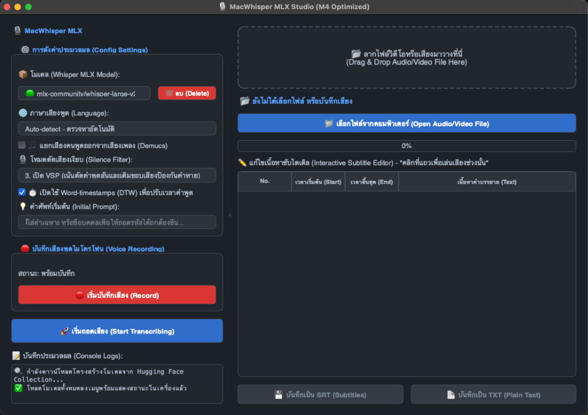

# MacWhisper MLX Studio 🎙️

A native macOS desktop application built with PyQt6 and optimized for Apple Silicon (M1/M2/M3/M4) GPUs, offering high-performance offline transcription using MLX Whisper.

## 📱 Application Interface



---

## 🌟 Key Features

1. **Local Model Status Indicators**: Shows `🟢 (อยู่ในเครื่อง)` for downloaded models and `⚪` for models that will be downloaded automatically upon transcription.
2. **Drag & Drop Zone**: Simply drag & drop any video or audio file to start transcribing.
3. **Voice Audio Recorder**: Record voice audio directly from within the app using your microphone (with a real-time recording timer).
4. **Demucs Vocal Separator**: Separate voices from background music/instruments using the high-performance `demucs-mlx` model.
5. **Silence Filter Modes**:
   * *Disable VAD*: Direct continuous transcription.
   * *Standard VAD (Silero VAD)*: Splits audio by standard silent regions.
   * *VSP (Voice Silence Padding)*: Perfect for short speech sections and padding audio borders.
6. **Word-Timestamps (DTW)**: Fuses precise timestamps at the word level for high-precision alignment.
7. **Interactive Subtitle Editor**: Click on any segment to play its specific audio slice, edit text inline, and export directly to `.srt` or `.txt`.

---

## 🛠️ Running from Source (Developer Mode)

### Prerequisites
Make sure you have Conda/Python installed and the necessary libraries:
```bash
pip install PyQt6 torch torchaudio sounddevice soundfile mlx-whisper huggingface_hub demucs-mlx
```

### Run the App
```bash
python whisper_m4_desktop.py
```

---

## 📦 How to Package into a Standalone macOS App (`.app`)

You can compile it into a fully self-contained bundle (contains its own Python environment and dependencies) so others can run it out of the box without needing Python installed.

### 1. Install PyInstaller
```bash
pip install pyinstaller pillow
```

### 2. Run the Build Command
```bash
pyinstaller --noconfirm --windowed --name "MacWhisperMLX" \
  --icon "applet.icns" \
  --paths "/Users/chanthana/miniforge3/lib" \
  --add-binary "/opt/homebrew/bin/ffmpeg:." \
  --add-binary "/opt/homebrew/bin/ffprobe:." \
  --collect-all mlx \
  --collect-all mlx_whisper \
  --collect-all demucs_mlx \
  --collect-all torch \
  --collect-all torchaudio \
  --collect-all torchcodec \
  --collect-all sounddevice \
  --collect-all soundfile \
  --collect-all huggingface_hub \
  --collect-all PyQt6 \
  whisper_m4_desktop.py
```

The resulting `MacWhisperMLX.app` bundle (~1.5 GB) will be located in the `dist/` directory.

---

## 📥 How to Download the Standalone App / วิธีดาวน์โหลดแอปใช้งาน

To download the pre-compiled standalone app, go to the **[Releases](https://github.com/TONSCENE/MacWhisperMLX/releases)** section of this repository and download the `MacWhisperMLX.zip` file.

---

### 🇹🇭 ภาษาไทย (Thai Instructions)

🚀 **MacWhisperMLX (Standalone App)**
ดาวน์โหลดไปแตกไฟล์แล้วเปิดใช้งานได้ทันที!

> [!WARNING]
> **รองรับชิป Apple Silicon เท่านั้น**
> ใช้ได้เฉพาะ Mac ที่เป็นชิป M1, M2, M3, M4 นะครับ (ไม่รองรับเครื่อง Intel)

> [!IMPORTANT]
> **วิธีเปิดแอปครั้งแรก (แก้ปัญหาติด Gatekeeper บล็อก)**
> เนื่องจากระบบความปลอดภัยของ macOS ให้ทำตามนี้ในครั้งแรกเพื่อเปิดใช้งานครับ:
> 1. คลิกขวา (หรือใช้ 2 นิ้วเคาะบน Trackpad) ที่ตัวแอป **MacWhisperMLX**
> 2. เลือก **Open** (เปิด)
> 3. กดปุ่ม **Open** อีกครั้งเพื่อยืนยัน
>
> > [!TIP]
> > **วิธีแก้ผ่าน Terminal (ทางเลือกเพิ่มเติมหากเปิดไม่ได้):**  
> > เปิดแอป Terminal แล้วรันคำสั่งนี้เพื่อปลดล็อกแอป (สมมติว่าย้ายแอปไปไว้ในโฟลเดอร์ Applications แล้ว):  
> > ```bash
> > xattr -cr /Applications/MacWhisperMLX.app
> > ```
> > *หรือ พิมพ์ `xattr -cr ` (เว้นวรรค 1 ครั้ง) แล้วลากตัวแอปจาก Finder มาวางใน Terminal แล้วกด Enter*

> [!NOTE]
> **การใช้งานครั้งแรกสุด**
> ตอนที่สั่งถอดความครั้งแรกสุด ตัวแอปจะมีการดาวน์โหลดโมเดล Whisper จากอินเทอร์เน็ตมาเก็บไว้ในเครื่องก่อน ให้ต่ออินเทอร์เน็ตทิ้งไว้สักครู่ในการรันครั้งแรกครับ (ครั้งต่อไปเปิดใช้งานแบบออฟไลน์ได้เลย)

---

### 🇺🇸 English (English Instructions)

🚀 **MacWhisperMLX (Standalone App)**
Download, extract, and start using it immediately!

> [!WARNING]
> **Apple Silicon Only**
> Compatible only with Apple Silicon Macs (M1, M2, M3, M4 series). Older Intel-based Macs are not supported.

> [!IMPORTANT]
> **First-time Opening (Bypassing macOS Gatekeeper Block)**
> Because this is an unsigned application, macOS security may prevent it from opening. To open it the first time:
> 1. Right-click (or tap with two fingers on your Trackpad) the **MacWhisperMLX** app icon.
> 2. Select **Open**.
> 3. Click **Open** again to confirm.
>
> > [!TIP]
> > **Alternative: Bypassing via Terminal**  
> > Open your Terminal app and run this command to remove the quarantine flag (assuming the app has been moved to Applications):  
> > ```bash
> > xattr -cr /Applications/MacWhisperMLX.app
> > ```
> > *Alternatively, type `xattr -cr ` (with a space) and drag-and-drop the app from Finder into the Terminal window, then press Enter.*

> [!NOTE]
> **First-time Run Setup**
> When transcribing for the very first time, the app will download the selected Whisper model from the internet and cache it locally. Please ensure you are connected to the internet during your first transcription. (All subsequent transcriptions can be run completely offline!)
